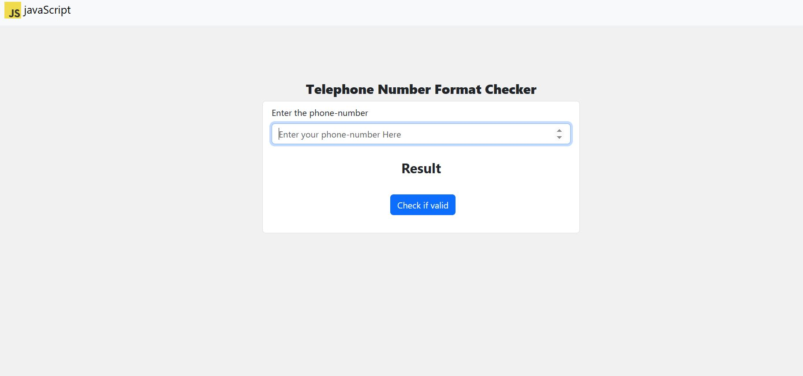
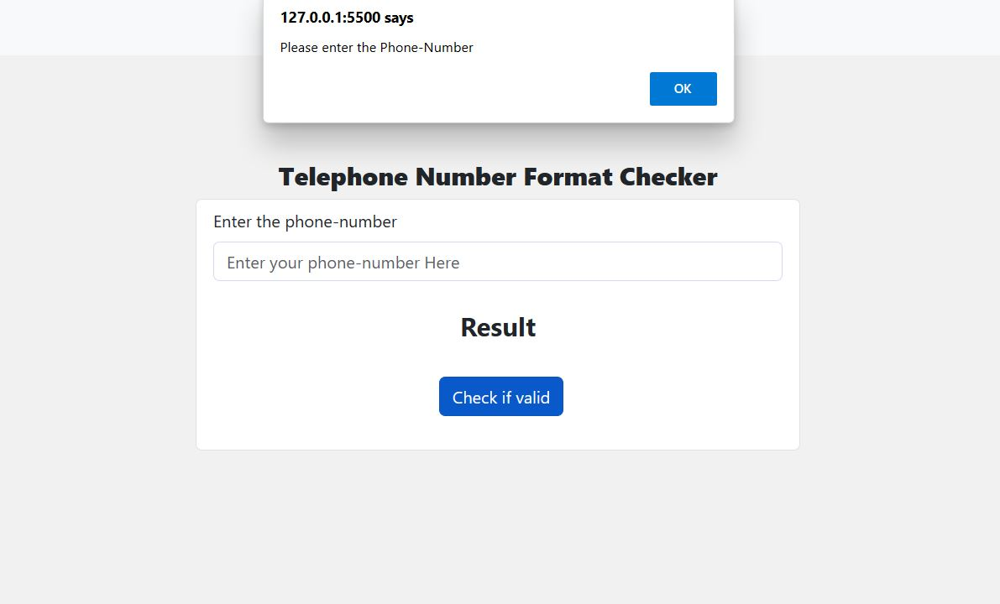
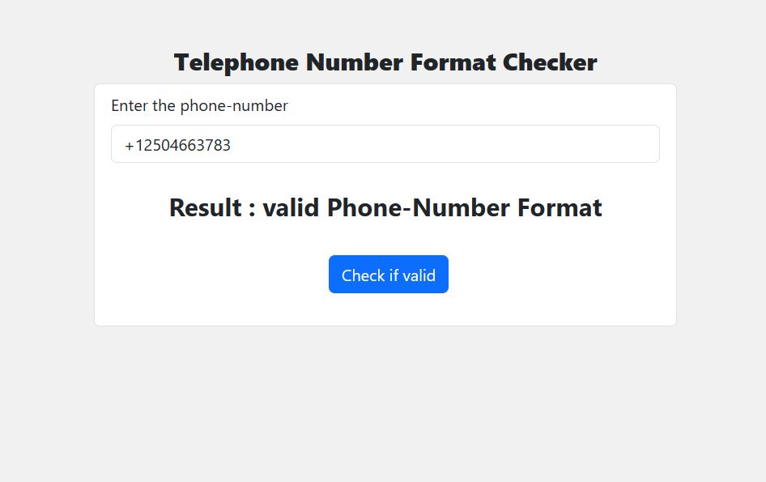
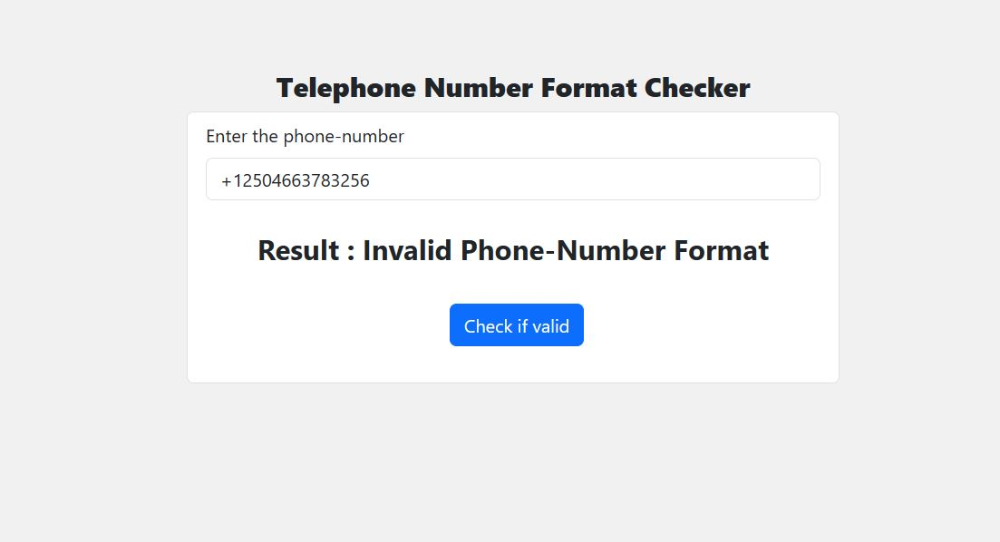

# Telephone or Mobile phone number format Checker.

This project is built using HTML, CSS, Bootstrap and JavaScript. It checks whether the given input is valid or not.

It checks the input by Regular Expression.

